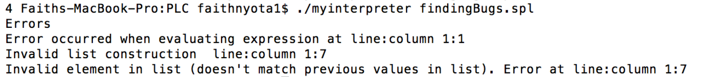
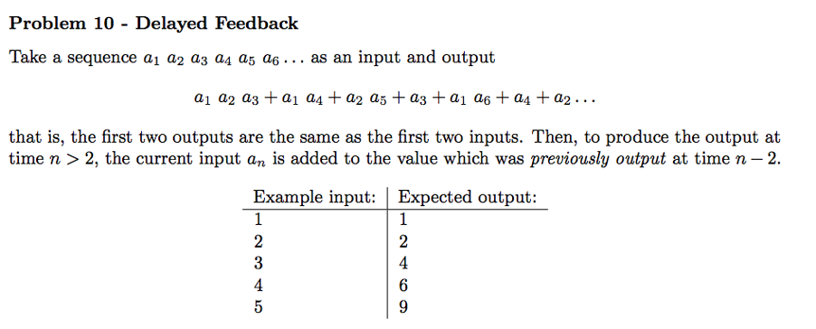
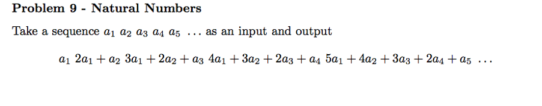
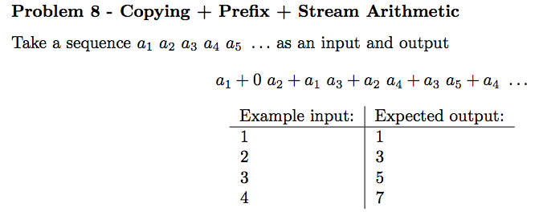
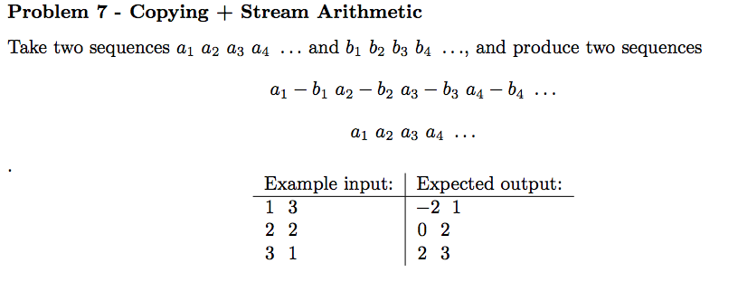
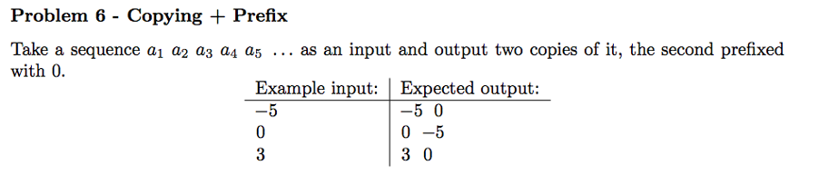

# Stream Processing Language
Commands for compiling:
alex Tokens.x  
happy Grammar.y  
ghc --make Main.hs  
Main <filename>  

## Introduction
SPL is a domain specific language used to process (potentially multiple) streams. SPL programs will output results as the input is being processed meaning that unbounded strings can be handled. The language is mainly built around the process stream function with other functions being mostly used as parameters for the process stream function.

## Features
As already mentioned, the main feature of the language is the process stream function that will be explained in greater detail below. SPL is similar to a functional language and user defined functions
can be written in a Haskell like manner, the main difference being that this language can have multiple statements.

## Program Syntax
Each program is a list of statements possibly followed by some function definitions. Each statement is followed by a semi colon (;) to show the end of that statement e.g.  
Statement1;  
Statement2;  
Function definition 1  
Function Definition 2  

## In-built Functions
Below is a list of functions built into the language that are split into sections, most functions are written as name(parameters) where multiple parameters are separated by commas:

### Statement functions
These are functions that can be used either as parameters for other functions or written as a statement in the language.  
out(output) – outputs the output parameter to the end of the output stream. The output parameter can also be another function in which case the output will be the result of the function.  
processStream(initial accumulator value, processing function , accumulator function , start index, end index, step value) – the most important function in the language. Its properties are described below.  
The function will iterate through the input stream starting at the start index value and stopping after executing on the end index.  
It will increment according to the step value, e.g. if the start index is 1, the end index is 3 and the step value is 2 the processStream function will only iterate twice (once on index 1 and once on index 3).  
In the processing function and the accumulator function two values can be referenced that are only in scope within the function, acc and R where R is the list of values at the current index of the input stream(s), R has length equal to the number of input streams (if there are 3 input streams R has length 3) and acc is the current accumulator value.  
On each iteration the processing function is executed, this processing function usually involves using the out function so that the result of the iteration is outputted (the result is not outputted automatically)  
On each iteration the accumulator function is also executed the result is what is saved to the accumulator for subsequent iterations to use in their calculations (this feature enables the function to remember previous values).  

### maths functions
These are functions that can only be used on numbers or functions that will result in a number.  
X + Y – basic addition function.  
X – Y – basic subtraction function.  
X * Y – basic multiplication function.  
X / Y – basic division function.  
X ^ Y – exponent function.  

### Boolean functions
These are functions that always result in a Boolean value when executed.  
X && Y – the AND operator, can only be used on Booleans or Boolean expressions.  
X || Y – the OR operator, can only be used on Booleans or Boolean expressions.  
NOT X – the NOT or negation operator, can only be used on a Boolean or Boolean expression.  
X == Y – the equals to operator, can be used on booleans or numbers, result is true if X equals Y.  
X != Y – the not equals operator, can be used on booleans or numbers, result if true if X does not equals  
Y. X > y – greater than operator, returns true if X is greater than Y.  
X < Y – less than operator, returns true if X is less than Y.  
X <= Y – less than or equal to operator, returns true if X is less than or equal to Y.  
X >= Y – greater than or equal to operator, returns true if X is greater than or equal to Y.  

### If then else statement
In SPL if statements must have an else at the end and they follow the form  
If (conditional) then (function1) else (function2)  
Where function1 is executed if the conditional evaluates to true and function 2 is executed if the conditional evaluates to false. The if then else statement can be used as a parameter for a function in our language.  
### User defined functions
In SPL functions can be defined similarly to Haskell, below the main statements of the program you can write functions that are used in the main statements. Functions are defined in the following form   
Identifier(parameter,...) = function definition using existing functions and parameters  
Where there can be any number of parameters inside the brackets (no commas are used if only one parameter is needed).   

### Commenting
Commenting is possible in SPL programs any text following two dashes (--) is ignored by the compiler. E.g. “out(3) --some text” is a valid program.

### Error Checking
SPL offers detailed error messages when programs are incorrect for example: 

## Example Code in SPL 

### Problem 10
  
processStream([],0, if((length(streams)-1)<=1)  
&nbsp;&nbsp;&nbsp;&nbsp;&nbsp;&nbsp;&nbsp;&nbsp;&nbsp;&nbsp;&nbsp;&nbsp;&nbsp;&nbsp;&nbsp;&nbsp;&nbsp;&nbsp;&nbsp;&nbsp;&nbsp;&nbsp;&nbsp;&nbsp;&nbsp;&nbsp;&nbsp;&nbsp;&nbsp;&nbsp;&nbsp;&nbsp;&nbsp;then (acc ++ [[ out(elem(R,0)) ]] ++ out([]) )  
&nbsp;&nbsp;&nbsp;&nbsp;&nbsp;&nbsp;&nbsp;&nbsp;&nbsp;&nbsp;&nbsp;&nbsp;&nbsp;&nbsp;&nbsp;&nbsp;&nbsp;&nbsp;&nbsp;&nbsp;&nbsp;&nbsp;&nbsp;&nbsp;&nbsp;&nbsp;&nbsp;&nbsp;&nbsp;&nbsp;&nbsp;&nbsp;&nbsp;else (acc ++ [[ out(elem(R,0) + get(acc,(length(streams)-1)-2,0) ) ]] ++ out([]) ),  
&nbsp;&nbsp;&nbsp;&nbsp;&nbsp;&nbsp;&nbsp;&nbsp;&nbsp;&nbsp;&nbsp;&nbsp;&nbsp;&nbsp;&nbsp;&nbsp;&nbsp;&nbsp;&nbsp;&nbsp;&nbsp;&nbsp;&nbsp;&nbsp;&nbsp;&nbsp;0,EOF,1);  
get(xss,x,y) = elem(xss,x) !! y;  
elem(xss,x) = xss !! x;  

### Problem 9
  
processStream(0,out([nat(streams,0)]),acc+1,0,EOF,1);  
nat(stream,k) = if(k<=length(stream)-1)  
&nbsp;&nbsp;&nbsp;&nbsp;&nbsp;&nbsp;&nbsp;&nbsp;&nbsp;&nbsp;&nbsp;&nbsp;&nbsp;&nbsp;&nbsp;&nbsp;&nbsp;&nbsp;&nbsp;&nbsp;&nbsp;&nbsp;&nbsp;&nbsp;&nbsp;then ( (length(stream) - k) * get(stream,k,0) + nat(stream,k+1) )  
&nbsp;&nbsp;&nbsp;&nbsp;&nbsp;&nbsp;&nbsp;&nbsp;&nbsp;&nbsp;&nbsp;&nbsp;&nbsp;&nbsp;&nbsp;&nbsp;&nbsp;&nbsp;&nbsp;&nbsp;&nbsp;&nbsp;&nbsp;&nbsp;&nbsp;else (0);  
get(xss,x,y) = elem(xss,x) !! y;  
elem(xss,x) = xss !! x;  

### Problem 8
  
processStream(0, out( if(acc==0)  
&nbsp;&nbsp;&nbsp;&nbsp;&nbsp;&nbsp;&nbsp;&nbsp;&nbsp;&nbsp;&nbsp;&nbsp;&nbsp;&nbsp;&nbsp;&nbsp;&nbsp;&nbsp;&nbsp;&nbsp;&nbsp;&nbsp;&nbsp;&nbsp;&nbsp;&nbsp;&nbsp;&nbsp;&nbsp;&nbsp;&nbsp;&nbsp;&nbsp;&nbsp;&nbsp;&nbsp;&nbsp;then ([elem(R,0)])  
&nbsp;&nbsp;&nbsp;&nbsp;&nbsp;&nbsp;&nbsp;&nbsp;&nbsp;&nbsp;&nbsp;&nbsp;&nbsp;&nbsp;&nbsp;&nbsp;&nbsp;&nbsp;&nbsp;&nbsp;&nbsp;&nbsp;&nbsp;&nbsp;&nbsp;&nbsp;&nbsp;&nbsp;&nbsp;&nbsp;&nbsp;&nbsp;&nbsp;&nbsp;&nbsp;&nbsp;&nbsp;else ([elem(elem(streams, acc-1),0) + elem(elem(streams, acc),0)]) )  
&nbsp;&nbsp;&nbsp;&nbsp;&nbsp;&nbsp;&nbsp;&nbsp;&nbsp;&nbsp;&nbsp;&nbsp;&nbsp;&nbsp;&nbsp;&nbsp;&nbsp;&nbsp;&nbsp;&nbsp;&nbsp;&nbsp;&nbsp;&nbsp;&nbsp;,acc+1,0,EOF,1);  
elem(xs,index) = xs !! index  

### Problem 7
  
processStream(0, out( [elem(R,0)-elem(R,1)] ++ [elem(R,0)] ), 0, 0, EOF, 1);  
elem(xs,index) = xs !! index;  

### Problem 6
  
processStream(0, out( if(acc==0)  
&nbsp;&nbsp;&nbsp;&nbsp;&nbsp;&nbsp;&nbsp;&nbsp;&nbsp;&nbsp;&nbsp;&nbsp;&nbsp;&nbsp;&nbsp;&nbsp;&nbsp;&nbsp;&nbsp;&nbsp;&nbsp;&nbsp;&nbsp;&nbsp;&nbsp;&nbsp;&nbsp;&nbsp;&nbsp;&nbsp;&nbsp;&nbsp;&nbsp;&nbsp;&nbsp;&nbsp;&nbsp;then ( [elem(R,0)] ++ [0])  
&nbsp;&nbsp;&nbsp;&nbsp;&nbsp;&nbsp;&nbsp;&nbsp;&nbsp;&nbsp;&nbsp;&nbsp;&nbsp;&nbsp;&nbsp;&nbsp;&nbsp;&nbsp;&nbsp;&nbsp;&nbsp;&nbsp;&nbsp;&nbsp;&nbsp;&nbsp;&nbsp;&nbsp;&nbsp;&nbsp;&nbsp;&nbsp;&nbsp;&nbsp;&nbsp;&nbsp;&nbsp;else ( [elem(R,0)] ++ [elem(elem(streams, acc-1),0)])), 
&nbsp;&nbsp;&nbsp;&nbsp;&nbsp;&nbsp;&nbsp;&nbsp;&nbsp;&nbsp;&nbsp;&nbsp;&nbsp;&nbsp;&nbsp;&nbsp;&nbsp;&nbsp;&nbsp;&nbsp;&nbsp;&nbsp;&nbsp;&nbsp;&nbsp;acc+1,0,EOF,1);  
elem(xs,index) = xs !! index;

### Problem 5
processStream(0, out( [work(streams)] ) ,acc+1,0,100,1);  
fib(n) = if(n<2) then (1) else ( fib (n-1) + fib (n-2) );  
elem ( yss, k ) = yss !! k;  
addFib ( stream, count ) = if(count>=0) then ( fib(count) * elem(head(stream),0) + addFib(tail(stream),count-1) ) else (0);  
work ( stream) = addFib( stream, length(stream)-1);  
cool (stream, row) = if(row<length(stream)) then ( cool(stream,row+1) ++ [addFib (stream,row)]) else ([] );  

### Problem 4
processStream(0, out( [elem(R,0) + acc] ) ,acc + elem(R,0) ,0,100,1);  
elem ( yss, k ) = yss !! k;  

### Problem 3
processStream(0, out( [elem(R,0) + (3*elem(R,1)) ] ), 0 ,0,100,1);  
elem ( yss, k ) = yss !! k;  

### Problem 2
processStream(0, out( R ++ R),0,0,100,1);  

### Problem 1
processStream(0, out( if(acc==0) then ([0]) else ([elem(elem(streams, acc-1),0)]) ) ,acc+1,0,100,1);  
elem(xs,index) = xs !! index  
